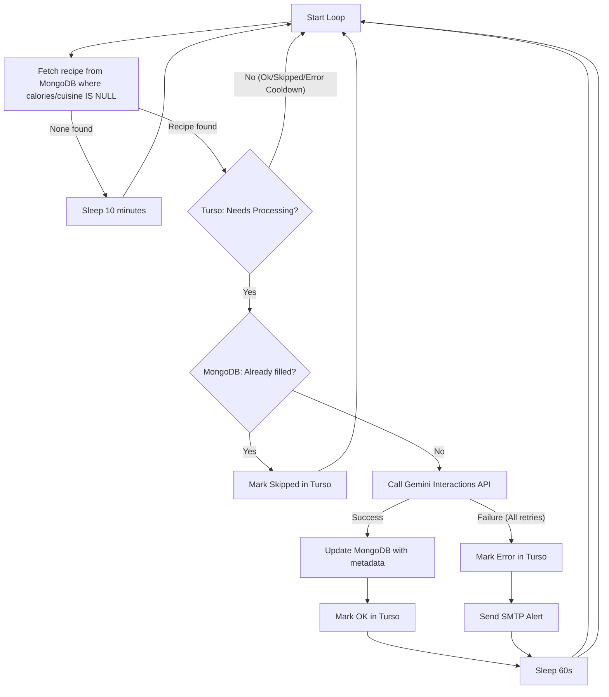

# Tagatoni System Architecture & Design

This document details the system design, purpose, architectural decisions, and error-handling strategies of the **Tagatoni** recipe audit agent.

---

## 1. Purpose

Tagatoni is a background daemon designed to automatically audit recipes posted in the Jorbites ecosystem. Using AI, it populates missing metadata required for SEO optimization and a better consumer user experience:
- **Calories**: An estimated count of calories per serving.
- **Recipe Cuisine**: Classification of cuisine origin (e.g., Italian, Spanish, Mexican, Mediterranean).

---

## 2. Architecture & Data Flow

Tagatoni runs as an always-on background process, interacting with MongoDB, Turso, the Gemini Interactions API, and SMTP servers.

### High-Level Flow Diagram



---

## 3. Database Integrations

### MongoDB (Core Data Store)
Tagatoni reads recipes directly from Jorbites' primary MongoDB store.
- **Query**: Searches for recipes where `calories` is missing/null **or** `recipeCuisine` is missing/null.
- **Update**: Enriches the document using the `$set` operator to add fields.

### Turso (Audit & State Preservation)
To keep the audit process robust, scalable, and independent of MongoDB query limits, we maintain an audit log in **Turso (libSQL)**.
- **Table Structure**:
  ```sql
  CREATE TABLE IF NOT EXISTS audited_recipes (
    recipe_id TEXT PRIMARY KEY,
    status TEXT NOT NULL,          -- "ok" | "skipped" | "error"
    retry_count INTEGER NOT NULL,  -- increments on failure
    last_attempt TEXT NOT NULL,    -- ISO-8601 timestamp
    error_msg TEXT                 -- contains the error cause
  )
  ```
- **State Flow**:
  - `ok`: Recipe successfully audited.
  - `skipped`: Recipe already has both fields filled (avoids double auditing).
  - `error`: Failed to process. A cooldown period must pass before retrying.

---

## 4. Gemini 3.5 Flash Interactions API Integration

Tagatoni uses the **Interactions API** (`/v1beta/interactions`) to obtain structured output representing the metadata.
- **Thinking Configuration**: The agent specifies `"thinking_level": "minimal"` to match free-tier guidelines.
- **Output Constraints**: An enforced JSON schema guarantees that the model returns exactly the JSON structure:
  ```json
  {
    "calories": <integer>,
    "recipeCuisine": <string>
  }
  ```
- **Cuisine Classification Enum List**: To prevent hallucinations, spelling variations, and inconsistent casings (e.g. "mexicano", "TexMex", "mexican cuisine"), the JSON schema enforces a strict string `enum` list in `recipeCuisine`. The allowed values are:
  - `Spanish`, `Catalan`, `Italian`, `Mexican`, `Japanese`, `Chinese`, `Indian`, `French`, `American`, `Mediterranean`, `Middle Eastern`, `Greek`, `Thai`, `Vietnamese`, `Moroccan`, `Turkish`, `Latin American`, `Caribbean`, `Nordic`, `British`, `German`, `Eastern European`, `African`, `Asian Fusion`, `International`
- **Robust Parsing**: The Interactions API returns a stateful `steps` timeline. Tagatoni iterates over the output steps to locate the `model_output` step, extracts the generated JSON, and deserializes it directly into the application model.

---

## 5. Resilience & Fault Tolerance

- **Exponential Backoff**: If the Gemini API returns a rate limit or HTTP error, the client retries up to 3 times per recipe (5s, 10s backoff intervals).
- **Error Cooldown & Retries**: When a recipe fails after all backoff retries, it is marked as `error` in Turso. It is locked out from execution for `24` hours to prevent hammering the API. It will be retried up to `3` times before being permanently locked.
- **SMTP Notification**: When a recipe exhausts all retries, the agent sends an alert email containing the error reason and recipe details, helping administrators troubleshoot issues.
